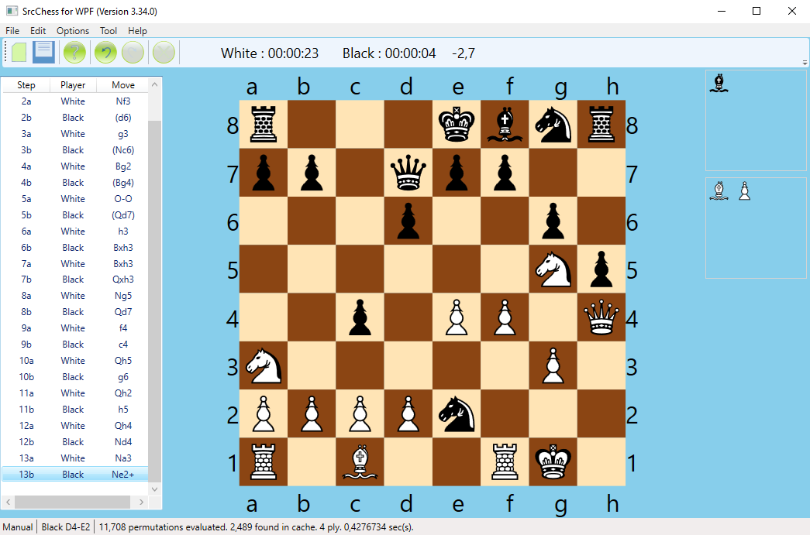
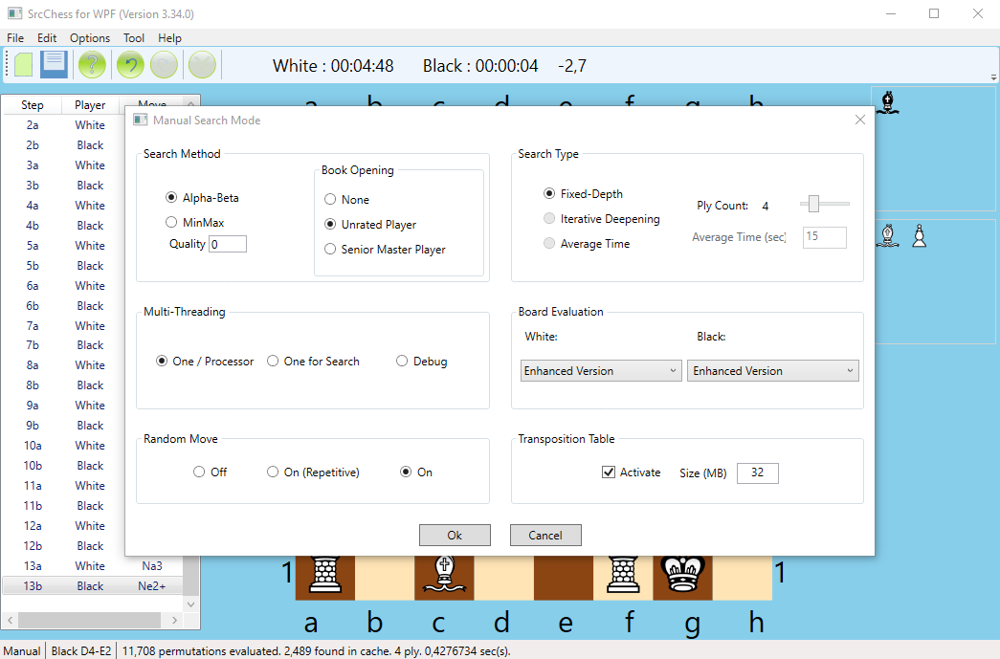

This is fork from https://www.codeproject.com/Articles/36112/Chess-Program-in-C

I upgraded the AI, so now playing will be a little harder.

For harder mode I recommend to use "Pawn-Attack version" or "Enhansed version" and even ply count.

